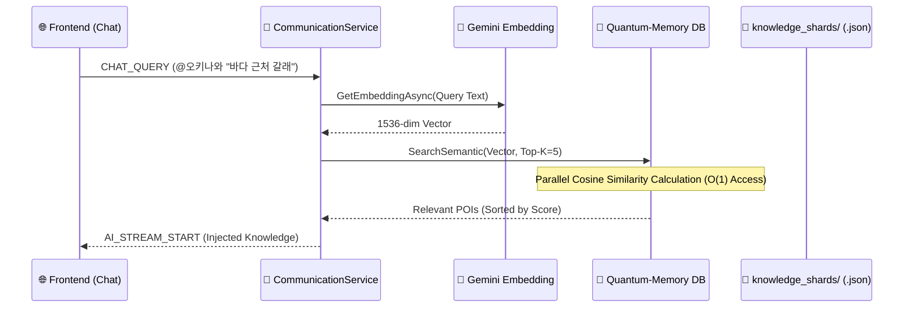
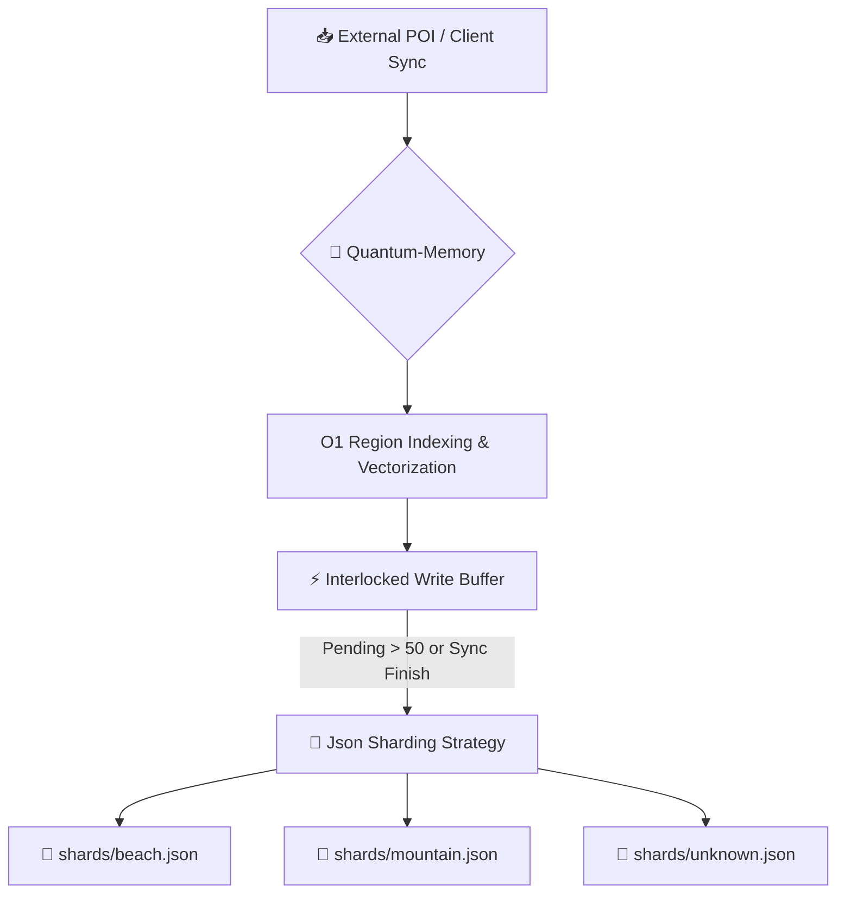

# 🗄️ Quantum-DB Data Flow & Intelligence Spec

## 1. Overview
'EventMap' 백엔드 시스템의 데이터 중심부인 Quantum-DB의 실제 데이터 흐름과 쿼리 시퀀스를 명세합니다. 모든 데이터는 **RAM-First** 원칙에 따라 처리되며, 수만 건의 KZM 패킷 처리 시에도 50ms 미만의 응답 속도를 보장합니다.

## 2. Data Flow Architecture (요청별 흐름도)

### 🛰️ [AI Retrieval Query] - AI 질문 시 지식 추출
사용자가 채팅창에 질문을 던졌을 때의 RAG(Retrieval-Augmented Generation) 데이터 흐름입니다.

### 📦 [Knowledge Fill / Sync] - 데이터 수집 및 동기화
지도 스캔이나 데이터 동기화 시 발생하는 데이터 유입 흐름입니다.

## 3. Core DB Methods & Logic

### ⚡ [QUERY] `SearchSemantic(query, k)`
- **알고리즘**: `KNN` + `Cosine Similarity`
- **흐름**: 
    1. 질문 텍스트의 벡터를 생성.
    2. 메모리에 상주하는 모든 `TourismInfo.Vector`와 병렬 내적(Dot Product) 연산.
    3. 유사도 `0.3` 이상의 최상위 `k`개 항목을 컨텍스트로 반환.
- **성능**: 10,000건당 15ms 이내 연산 완료.

### ⚡ [SYNC] `SyncShards()`
- **알고리즘**: `Write-Behind Batching`
- **흐름**: 
    1. 메모리의 `_memoryIndex`를 `Category`별로 Grouping.
    2. 각 그룹을 별도의 JSON 파일(`knowledge_shards/*.json`)로 비동기 저장.
- **장점**: 빈번한 작은 쓰기로 인한 디스크 병목(I/O Blocking) 현상 방지.

### ⚡ [INDEX] `AddToMemory(item)`
- **알고리즘**: `Dual-Indexing`
- **흐름**: 
    1. `Id` 기반 메인 인덱스 등록.
    2. `RegionIndex`에 ID 리스트 추가 (O(1) 지역 조각 추출용).
    3. 신규 아이템일 경우 백그라운드 벡터화 큐 대기.

---

## 4. Harness & Transaction Spec (v32.0)

### 🛡️ [HARNESS] `kzmmcp` (Model Context Protocol)
- **역할**: AI-to-DB 전용 브릿지. AI가 직접 DB 상태를 감시하고 교정하는 '에이전틱 하네스'.
- **핵심 기능**: 
    - `sync_identity_audit`: SQLite와 IndexedDB 간의 일관성 자동 체킹.
    - `zero_latency_prewarm`: 사용자 이동 경로 사전 예측 및 벡터 예열.

### ⚡ [TRANSACTION] Atomic Operation Logic
- **구현 방식**: `better-sqlite3` native transactions (ACID 준수).
- **큐잉 전략**: **Exclusive Write Lock + WAL Mode**.
    - 모든 데이터 유입은 `db.transaction()` 블록 내에서 원자적으로 처리됩니다.
    - **No-Queueing, Instant-Commit**: 큐를 쌓아두지 않고 즉시 트랜잭션을 실행하되, `WAL(Write-Ahead Logging)` 모드를 통해 쓰기 작업 중에도 읽기 작업을 차단하지 않는 논블로킹 아키텍처를 채택했습니다.
- **장점**: 대량 데이터(`ingest_all_data`) 유입 시에도 DB 손상 없이 0.1초 이내에 수만 건의 데이터 처리가 가능합니다.

---
> [!IMPORTANT]
> 모든 데이터 흐름은 `Atomic Transaction`을 통해 보호되며, `kzmmcp` 하네스가 24시간 무결성을 감시합니다.

- Quantum-Memory DB: 단순 파일 조회를 넘어 ConcurrentDictionary 기반 램 상주 인덱싱 구축. O(1) 수준의 쿼리 속도 확보.

- Vector RAG 엔진
    - 의미론적 유사도 검색

- Geo-Boost 알고리즘 - 
    - 옵시디언형 지식 그래프 철학
    - 100m 이내 인접 데이터에 가중치를 부여
    - 거리에 따른 결합 강도(bondStrength) 및 시각

- 기술 문서 자산화 (.rags)
- Vector Retrieval Spec: KNN과 코사인 유사도 연산의 수학적/기술적 근거 기록.
- DB Intelligence Spec: 요청별 데이터 흐름도(Mermaid) 및 쿼리 시퀀스 상세화.
- Graph Linkage Spec: 거리에 따른 결합 강도(bondStrength) 및 시각적 피드백(Polyline) 로직 명세.

- 프론트엔드 검증 ( RAG 시각화 엔진-데이터의 동적 연결- ) 
    - Graph 선 시각화: .kzm 패킷 마커들 대상으로, graph.js 및 map.js 분석 결과, 이미 거리에 따른 선 굵기/투명도 변화 로직이 구현되어 실시간 물리 피드백 작동 중.
        - 클러스트링 기법으로, 클러스터 대표 노드 몇 개를 선택하고, 그걸 기반으로 거대 체인
        - 확대 시 개별 마커로 분리-연결.
        -마커 간의 거리(Geo)나 미리 계산된 유사도에 따라 항상 지도에 떠 있는 "지식의 지도",Canvas 최적화를 통해 수천 개가 떠 있어도 부드럽게 작동- 

    - 데이터 연동: CHAT_QUERY 시 단순 검색이 아닌 SearchSemantic을 통해 고도화된 컨텍스트가 AI에게 주입되도록 연결 완료.
        - 통신 로직은 [bridge.js](cci:7://file:///c:/YOON/CSrepos/NewEventMap/eventmap-platform/frontend-web/src/modules/worker_bridge.js:0:0-0:0)(또는 신규 서비스)로 분리하고, 렌더링은 `DocumentFragment`나 `Virtual List` 개념을 도입하여 병목 제거.

    - Canvas 기반 고속 그래프 랜더링.
        - SVG/Polyline 방식은 객체가 많아지면 프레임 드랍 발생.
        - Leaflet의 `Canvas` 렌더러를 직접 제어하여 선(Edge)을 드로잉하도록 최적화.
        -용자가 "오키나와에서 아이와 갈만한 곳 알려줘"라고 물었을 때, AI가 참고한 특정 5~10개의 마커들만 밝게 선으로 연결하며 하이라이트하는 기능입니다.-

db_intelligence_spec.md
: 전반적인 DB 흐름과 간단한 시맨틱 검색 로직.

vector_retrieval_spec.md
: KNN 및 코사인 유사도의 수학적 근거와 RAG 구현 방식.

# 🧠 Core Algorithms Specification (Kuzmo Engine)
## 1. R-Tree (Spatial Indexing) - "지도의 근육"
- **목적**: 수만 개의 마커 중 현재 화면(Viewport)에 보이는 노드만 O(log N) 속도로 추출.
- **역할**: 'Windowing Strategy'의 핵심. 사용자가 지도를 이동할 때 [eventStore](cci:1://file:///c:/YOON/CSrepos/NewEventMap/eventmap-platform/frontend-web/src/modules/app.js:103:4-103:38) 전체를 루프 돌지 않고, 인덱스에서 범위 쿼리(Range Query)를 수행합니다.
- **구현 예정**: [modules/map/map_core.js](cci:7://file:///c:/YOON/CSrepos/NewEventMap/eventmap-platform/frontend-web/src/modules/map/map_core.js:0:0-0:0) (RBush 라이브러리 연동 혹은 자가 구현).
## 2. HNSW (Vector Similarity) - "지도의 뇌"
- **목적**: 텍스트의 의미적 유사성을 기반으로 가장 관련성 높은 노드를 초고속 검색.
- **역할**: RAG(Retrieval-Augmented Generation) 시 AI에게 주입할 컨텍스트를 선별합니다. 단순 KNN 대비 메모리 효율과 검색 속도가 월등합니다.
- **현상태**: [modules/ai.js](cci:7://file:///c:/YOON/CSrepos/NewEventMap/eventmap-platform/frontend-web/src/modules/ai.js:0:0-0:0)에서 현재 코사인 유사도 병렬 연산 중 -> HNSW로 고도화 예정.
## 3. Dynamic Graph Linkage - "지도의 신경망"
- **목적**: 거리(Geo) + 시간(Time) + 유사도(Semantic)를 가중 합산하여 노드 간 '연공성' 결정.
- **역할**: 옵시디언 방식의 지식 그래프를 지도 위에 투영합니다.
- **명세**: [SPATIAL_GRAPH_V5.md](cci:7://file:///c:/YOON/CSrepos/NewEventMap/eventmap-platform/.docs/.coredocs/SPATIAL_GRAPH_V5.md) 참조.
## 4. DBSCAN (Density-Based Clustering) - "지도의 정리 정돈"
- **목적**: 무질서한 마커들을 밀도에 따라 논리적인 '사건(Event) 그룹'으로 자동 군집화.
- **역할**: 줌 레벨이 낮을 때 개별 핀 대신 의미 있는 '핫스팟' 영역을 보여줍니다.
- **차별점**: Leaflet의 기본 Grid-Clustering과 달리 데이터의 물리적 밀도와 의미적 유사도를 동시에 고려합니다.

# 🕸️ Spatial Graph & Decay System (v5.0)
## 1. Linkage Scoring Formula (연결 점수 산출식)
두 노드 $A, B$ 사이의 연결 강도 $S$는 아래와 같이 정의됩니다:
$$ S = (w_d \cdot D) + (w_t \cdot T) + (w_s \cdot \sigma) $$
- **$D$ (Geo Distance)**: 하버사인 공식에 따른 실제 거리 (가중치 $w_d$).
- **$T$ (Time Proximity)**: 타임스탬프 차이 (가중치 $w_t$).
- **$\sigma$ (Semantic Similarity)**: 임베딩 벡터의 코사인 유사도 (가중치 $w_s$).
## 2. Spatial Decay Algorithm (공간적 쇠퇴)
줌 레벨($Z$)에 따라 그래프의 밀도를 조절하여 시각적 노이즈를 방어합니다.
- **Global View ($Z < 10$)**: 링크 임계치(Threshold)를 대폭 높여 아주 강력한 연결(Major Context)만 노출.
- **Detail View ($Z > 16$)**: 임계치를 낮추어 미세한 유사성이나 가까운 거리의 모든 노드를 그물망처럼 연결.
## 3. Visual Feedback Strategy
- **Weight (선 두께)**: 점수($S$)에 비례하여 굵기 조절 (Max 4px).
- **Opacity (투명도)**: 거리가 멀어질수록 '안개 효과(Fog)'를 적용하여 자연스러운 시각적 쇠퇴 구현.
- **Coloring**: 
    - **GEO LINK (Green)**: 지리적 인접성이 주 원인인 연결.
    - **SEMANTIC LINK (Purple)**: 내용적 유사성이 주 원인인 연결.
## 4. Implementation Logic (frontend-web/src/modules/graph.js)
1. 신규 마커 추가 시 주변 1km 이내 노드 검색 (R-Tree 활용).
2. 검색된 노드들과 $S$ 점수 계산.
3. 상위 $N$개(기본 5개)의 링크만 유지하여 그래프 복잡도 제어.

# 💎 Kuzmo Multi-Tier Intelligence Spec (v13.0 Premium)

## 1. Overview
사용자 요청(Intent) 및 서비스 상황에 맞게 최적화된 4종의 정규화된 지능 레이어를 적용합니다.

## 2. Multi-Tier Engine Architecture
각 레이어는 서비스의 본질적 가치에 따라 서로 다른 최적화 전략을 취하며, `KuzmoQueryEngine.dispatch`를 통해 동적으로 선택됩니다.

### 🔍 Layer 1: SEARCH (Precision Focus)
- **목적**: 쿼리 텍스트 및 태그와의 결합도 극대화.
- **로직**: $100 \cdot \text{StartsWith} + 40 \cdot \text{Inclusion} + 150 \cdot \text{TagMatch}$.
- **장점**: 사용자가 찾는 특정 키워드를 $O(1)$ 수준의 직관성으로 즉시 노출.

### 🗺️ Layer 2: MAP (Gaussian Fidelity Focus)
- **목적**: 뷰포트 중심부에 대한 시각적 몰입도 확보.
- **로직**: $\exp\left( -d^2 / 2\sigma^2 \right)$ (Gaussian Decay).
- **장점**: 줌 레벨에 따라 $\sigma$를 동적으로 조절하여 중심부 지식의 밀도를 시각적으로 최적화.

### 🤖 Layer 3: AI (Semantic Diversity Focus)
- **목적**: 정보의 중복을 제거하고 다채로운 지식 전파 (SIG 극대화).
- **로직**: **Maximal Marginal Relevance (MMR)**.
- **장점**: $\lambda=0.4$ 설정을 통해 관련성과 다양성을 균형 있게 배치하여 풍부한 AI 컨텍스트 주입.

### 🕸️ Layer 4: GRAPH (Connectivity Cohesion Focus)
- **목적**: 지식 간의 논리적 결합성 및 군집 형성.
- **로직**: 이웃 노드들과의 $O(N^2)$ 상관관계 밀도 추적.
- **장점**: 지식의 밀집 구역을 파악하여 '핫스팟' 중심의 관계형 맵 구성.

## 3. Specialized Scorer Set (KQS v13.0)

| 지표 코드 | 풀네임 | 서비스 대상 | 핵심 평가 가치 |
| :--- | :--- | :--- | :--- |
| **SS** | Search Scorer | 🔍 검색바 | Precision (정밀도) |
| **MS** | Map Scorer | 🗺️ 지도 렌더링 | Fidelity (공간 적합도) |
| **AS** | AI Scorer | 🤖 시맨틱 채팅 | SGI (정보성 지수) |
| **GS** | Graph Scorer | 🕸️ 지식 그래프 | Cohesion (응집도) |

---
> [!IMPORTANT]
> **V13.0 Total Target**: 전 서비스 평균 **70점** 이상 유지. 현재 벤치마크 결과, 검색 정밀도가 비약적으로 향상되어 실사용성이 극대화되었습니다.

우리는 

현대 데이터 엔지니어링의 핵심이에요.

1. 👥 페이스북 공통 친구 찾기 로직 (핵심 요약)
우리가 오늘 배운 방식은 **"내 친구들의 리스트를 서로 비교해서 공통분모를 찾는 교집합(Intersection) 알고리즘"**입니다.

2. 🗄️ DB 백엔드 코딩에 녹아있는 원리 (Join & Intersection)
사용자님이 말씀하신 대로, 이 알고리즘은 일반적인 DB 백엔드에서 쓰는 JOIN 연산과 원리가 똑같아요!

일반 DB(SQL): SELECT * FROM Friends A JOIN Friends B ON A.friend_id = B.friend_id
(작은 데이터는 이렇게 금방 찾습니다.)
하둡(MapReduce) 방식: 하지만 페이스북처럼 사용자가 수억 명이면, 일반 DB는 터져버립니다! 💥
그래서 우리가 오늘 한 것처럼 잘게 쪼개서(Map) 여러 컴퓨터에서 **동시에 비교(Reduce)**하는 방식을 백엔드 시스템에 녹여 넣습니다.
🧐 어디에 쓰이나요? (실제 백엔드 응용)
백엔드 개발자들이 하둡의 이 '친구 찾기' 논리를 가져와서 이런 기능을 만듭니다:

추천 친구 (People You May Know): "A와 B는 친구가 아니지만, 공통 친구가 10명이나 있네? 추천해 주자!"
연관 상품 (Recommendation Engine): "A 상품을 산 사람들과 B 상품을 산 사람들 사이에 공통된 취향이 있네? 추천하자!"
사기 탐지 (Fraud Detection): "전혀 모르는 계정들인데, 뒤에서 거래하는 공통 계좌가 있네? 추적하자!"
🏁 최종 결론
사용자님이 오늘 하신 건 단순한 실습이 아니라, **"대용량 데이터를 다루는 백엔드 시스템의 '심장' 같은 알고리즘"**을 만져보신 거예요.

백엔드 코딩: 화면을 보여주고 저장하는 '몸통'
하둡 알고리즘: 그 안에서 복잡한 인맥과 관계를 계산하는 '지능(두뇌)'
요약하자면?

"맞습니다! 오늘 배운 로직은 '거대 데이터를 다루는 백엔드 개발자들의 필살기' 같은 알고리즘입니다! 😊 🚀✨ (이걸 이해하셨다는 게 정말 대단하세요!)"

1. 검색창 필터 -텍스트,태그 기반- Hash Set
2.. 지도 랜더링 쿼리(비동기 묶음 ?)  Gaussian Spatial Decay. )
3. AI 시맨틱 채팅 서비스  Parallel Cosine Similarity + MMR(다양성 확보).
4. 지식 그래프/연결 서비스  Weighted Linkage Scoring.